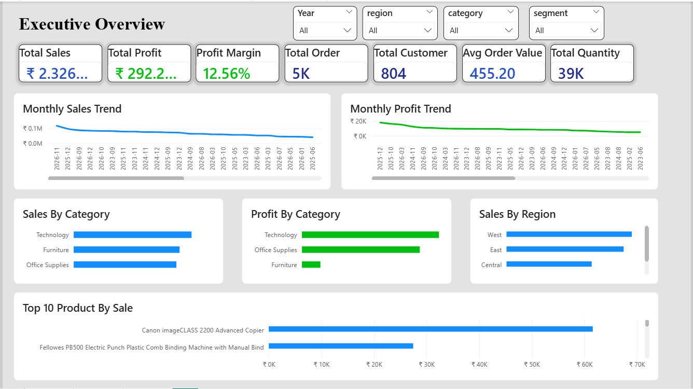
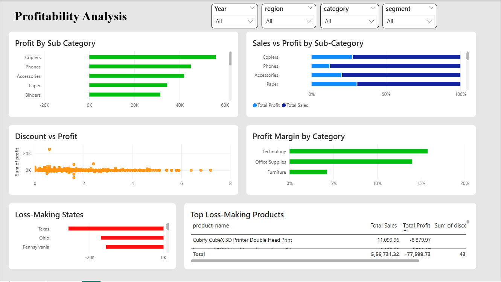
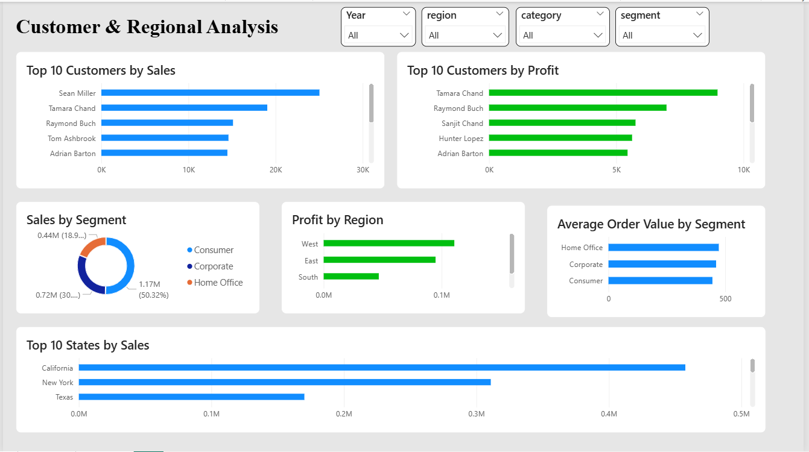

# Retail Sales & Profitability Analysis Dashboard | SQL + Power BI

An end-to-end retail analytics project built using **SQL** and **Power BI** to analyze **sales, profit, customer behavior, product performance, and regional trends** from the Superstore dataset.

---

# Project Overview
This project focuses on analyzing retail business performance and turning raw transaction data into business insights. The dashboard was designed to help answer questions such as:

- How is the business performing overall in terms of **Sales, Profit, Orders, and Customers**?
- Which **categories, sub-categories, products, and states** are driving profit or causing losses?
- How do **discounts affect profitability**?
- Which **customers, segments, and regions** contribute the most to revenue and profit?

The final solution includes:
- **SQL-based data cleaning and analytical queries**
- **Power BI dashboard development**
- **3 interactive dashboard pages**
- **KPI reporting + business insights**

---

# Objectives
The goals of this project were to:

- Track business performance using KPIs such as **Sales, Profit, Orders, Customers, Quantity, and Average Order Value**
- Analyze **monthly sales and profit trends**
- Identify **profit-driving and loss-making categories, products, and states**
- Study the relationship between **discount and profitability**
- Analyze **customer contribution, segment performance, and regional performance**
- Build a professional dashboard for business reporting and decision-making

---

# Tools & Skills Used

## Tools
- **SQL**
- **Power BI**
- **CSV Dataset**

## Skills Demonstrated
- Data Cleaning
- Data Transformation
- DAX Measures
- KPI Reporting
- Dashboard Design
- Sales Analysis
- Profitability Analysis
- Customer Analysis
- Regional Analysis
- Business Insight Generation

---

# Dataset
- **Dataset Used:** Superstore Dataset
- **Source File:** `Dataset/superstore.csv`

The dataset contains retail transaction-level information such as:
- Order details
- Customer details
- Product category and sub-category
- Sales, quantity, discount, and profit
- Region / state / city information
- Shipping details

---

# Dashboard Pages

## Page 1 — Executive Overview
This page provides a high-level summary of business performance.

### Visuals Included
- KPI Cards:
  - Total Sales
  - Total Profit
  - Profit Margin %
  - Total Orders
  - Total Customers
  - Total Quantity
  - Average Order Value
- Monthly Sales Trend
- Monthly Profit Trend
- Sales by Category
- Profit by Category
- Sales by Region
- Top 10 Products by Sales

### Key Business Questions Answered
- What is the overall business performance?
- Are sales and profit growing over time?
- Which categories and regions drive the most sales and profit?
- Which products generate the highest sales?

---

## Page 2 — Profitability Analysis
This page focuses on profitability drivers and loss-making areas.

### Visuals Included
- Profit by Sub-Category
- Sales vs Profit by Sub-Category
- Discount vs Profit Scatter Analysis
- Profit Margin by Category
- Loss-Making States
- Top Loss-Making Products

### Key Business Questions Answered
- Which sub-categories are the most profitable?
- Which products or states are loss-making?
- Is discount negatively impacting profit?
- Which categories have weak margins despite strong sales?

---

## Page 3 — Customer & Regional Analysis
This page focuses on customers, segments, and geographic performance.

### Visuals Included
- Top 10 Customers by Sales
- Top 10 Customers by Profit
- Sales by Segment
- Profit by Region
- Average Order Value by Segment
- Top 10 States by Sales

### Key Business Questions Answered
- Who are the top customers by sales and profit?
- Which customer segment contributes the most revenue?
- Which region is the most profitable?
- Which states drive the highest sales?

---

# Dashboard Screenshots

## Page 1 — Executive Overview


## Page 2 — Profitability Analysis


## Page 3 — Customer & Regional Analysis


---

# SQL Work Performed
SQL was used for:
- Table creation
- Data cleaning and transformation
- Shipping day calculation
- Profit margin calculation
- KPI extraction
- Customer, product, and regional analysis
- Profitability and discount impact analysis

### Example SQL analysis areas
- Total Sales / Profit / Orders / Customers
- Monthly Sales and Profit trends
- Sales by Category and Region
- Profit by Sub-Category
- Top Customers by Sales / Profit
- Loss-Making Products and States
- Discount impact analysis

SQL file available here:
- `SQL/retail_analysis_queries.sql`

---

# Power BI Work Performed
Power BI was used for:
- Importing and modeling data
- Creating relationships
- Building DAX measures
- Designing 3 dashboard pages
- Creating slicers and interactive filtering
- Building KPI cards and business visuals

---

# DAX Measures Used
Examples of DAX measures created in the project:

```DAX
Total Sales = SUM(superstore[sales])

Total Profit = SUM(superstore[profit])

Total Orders = DISTINCTCOUNT(superstore[order_id])

Total Customers = DISTINCTCOUNT(superstore[customer_id])

Total Quantity = SUM(superstore[quantity])

Average Order Value = DIVIDE([Total Sales], [Total Orders])

Profit Margin % = DIVIDE([Total Profit], [Total Sales], 0)
```

---

# Key Insights
Some important insights from the analysis:

- Some **sub-categories generate high sales but weak profit**, indicating margin issues.
- **Discount-heavy products** tend to show weaker profitability in many cases.
- A small group of **top customers contributes a significant share of revenue and profit**.
- Some **states are loss-making despite active sales**, which may indicate pricing, shipping, or discount problems.
- **Category and regional analysis** helps identify where the business should focus to improve profitability.
- Technology generated the highest profit.
- Furniture showed lower margins despite high sales.
- Texas recorded the largest losses.

---

# Business Recommendations
Based on the analysis, the following recommendations can be considered:

1. **Reduce excessive discounting** on low-margin products.
2. Review **loss-making products and states** to identify pricing or shipping inefficiencies.
3. Focus retention and upselling efforts on **top-performing customers and segments**.
4. Prioritize **high-profit categories and sub-categories** for business growth.
5. Use regional performance insights to improve strategy in underperforming areas.

---

# Project Structure
```text
Retail-Sales-Profitability-Analysis/
│
├── Dataset/
│   └── superstore.csv
│
├── SQL/
│   └── retail_analysis_queries.sql
│
├── PowerBI/
│   └── retail_sales_profitability_dashboard.pbix
│
├── Screenshots/
│   ├── page1_executive_overview.png
│   ├── page2_profitability_analysis.png
│   └── page3_customer_regional_analysis.png
│
└── README.md
```

---

# Files Included
- `Dataset/superstore.csv` → Source dataset
- `SQL/retail_analysis_queries.sql` → SQL queries used for analysis
- `PowerBI/retail_sales_profitability_dashboard.pbix` → Power BI dashboard file
- `Screenshots/` → Dashboard screenshots
- `README.md` → Project documentation

---

# How to Use This Project
1. Download or clone the repository
2. Open the dataset from the `Dataset/` folder
3. Review SQL queries from the `SQL/` folder
4. Open the Power BI dashboard file from the `PowerBI/` folder
5. Explore the screenshots and README for project summary and insights

---

# Project Outcome
This project demonstrates an end-to-end retail analytics workflow combining **SQL, Power BI, KPI reporting, profitability analysis, and customer/regional insights**. It is designed as a portfolio project to showcase both **technical dashboarding skills** and **business problem-solving ability** for Data Analyst roles.
